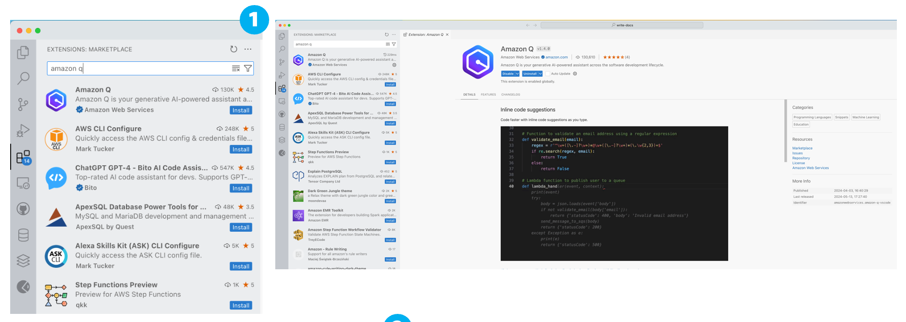

## Next Generation Developer Tools

*A hands on guide to working with Amazon Q Developer. Made by DevRel with 💖.*

In this hands on lab, we are going to run through how to use the next generation of developer tooling to help make our jobs as developers more enjoyable and productive.

We will create a new application from scratch, and then build upon this and perform many of the tasks you would typically do as a developer. 

One thing to bear in mind before we start. Unlike other workshops, because of the non deterministic nature of these tools, there is no guarantee that the output will be the same as what your peers will see. What that means is that if you are working in groups, you can all expect different outputs. We have provided a [sample repo](https://github.com/094459/ada-python-demo-app) that you can use as a baseline, but we encourage you to explore and work with your own experiments - this is the most effective way of learning how these tools work.
 
The workshop is split into a number of different labs, with some lectures as well. This is what we will cover

* Introduction to next generation developer tools
* Setting up, and getting starting with Amazon Q Developer
* Building our URL Shortener application
* Fixing and improving our application
* Adding new features
* Running Security scans
* Adding Tests
* Documenting our application

---

**What you will need**

You will need VScode IDE (or as an alternative, IntelliJ) with the following VSCode plugins installed

* Amazon Q Developer plugin - https://marketplace.visualstudio.com/items?itemName=AmazonWebServices.amazon-q-vscode
* * [Download v1.3](https://github.com/aws/aws-toolkit-vscode/releases/download/amazonq/v1.3.0/amazon-q-vscode-1.3.0.vsix) - do not use (1.4) 
* Python plugin for VScode - https://marketplace.visualstudio.com/items?itemName=ms-python.python
* PostgreSQL cli tools - "brew install postgresql" (Mac) , use the windows installer to just install the cli tools (windows), or "sudo apt get install libpq-dev" (Ubuntu),"sudo dnf install libpq-devel" (Fedora)
* Python 3.10 or newer
* git

You will access to a Postgres database. At the end of this lab, there are instructions on how you can run a local Postgres database using Docker or Finch.

**Getting your environment ready**

Once you have read the pre-req's, it is time to start up VSCode.

We will be using files in the following GitHub repo, [ada-python-demo-app](https://github.com/094459/ada-python-demo-app). The repo has a number of different branches which have been used to checkpoint the code at different stages. This will make it easy for you to follow along. For those unfamiliar with git, we will use the following syntax

```
git checkout <branch name>
```

This will change the files open in your VSCode, so do not be alarmed if they change - it will most likely be the branch you are in. You can explore the branches via the GitHub gui, or via the cli by typing "git branch -a".

On your laptop, find a working directoy you want to use for this lab. From VScode, open up a new Terminal window, and from command prompt run the following to start our database.

Mac/Linux
```
cd <your working directory>
python -m venv ada-lab
cd ada-lab
source bin/activate
git clone https://github.com/094459/ada-python-demo-app.git
cd ada-python-demo-app
```
Windows
```
cd <your working directory>
git clone https://github.com/094459/ada-python-demo-app.git
cd ada-python-demo-app
```

Use the Python VScode plugin to create a new Virtual environment (venv) using a version of Python that is equal or greater than 3.10. This should create a .venv directory. You can then activate it from the terminal.

```
 .\.venv\Scripts\activate
```

**How do follow along**

Given the non deterministic nature of generative AI tools, the output you will get from running these prompts will be different to the output I got when creating this. You might be asking yourself, how will I know what is right or wrong, and how will I cope if things go horribly wrong? This is kind of intentional. Working with generative AI tools like Amazon Q Developer open you up to a new flow, a new way of working. If your expectation was that these tools will generate working code every time, then it is time to reset that expectation. The output that these tools provide will be your starting point, and get you 80% of the way there. You can then use Amazon Q Developer to help iterate and complete the remaining. If that does not work, at each different section of this lab, the git repo has a number of checkpoints. These have been implemented as branches, so you can start off without worrying if the previous lab failed.

Everyone running through this lab will have a different experience, but I hope the takeaway from this is a better understanding of the flow you will start to develop in using these tools to write software.

If you are working through this in a group setting, then the person running the lab will lead from the front and you can take your guidance from them.

#  Introduction to next generation developer tools (45 min)

To kick things off you will look at a quick overview of what we mean by generative AI developer tools. This will take a look at the typical use cases where developers can apply them, take a look at developer journeys in more detail, before finishing up with some tips as to how to use them effectively.

This will set you up nicely for the practical hands on element, where we will actually do some of those use cases.

# Setting up, and getting starting with Amazon Q Developer (20 min)

We are now ready for the first hands on part of this lab, setting up the generative AI developer tooling we are going to be using. We are going to be using Amazon Q Developer, a next generation developer tool that provides you with in-line code suggestions and a chat interface to help your developer flow. This is installed into your IDE (VSCode and IntelliJ are supported) via a plugin. Once the plugin is installed, we need to login using something that is called a Builder ID account. This allows you to access the Free Tier of Amazon Q Developer, without the need for an AWS account. So we first need to set that up, and then install the Amazon Q Developer plugin.

**Creating your Builder ID**

Creating a Builder ID is the first step in being able to use the Amazon Q Developer plugin. All you need is a valid email address to create a Builder ID. Head over to the [Builder ID page](https://profile.aws.amazon.com/) and then complete the creation by registering a valid email address. You can follow these screenshows to see the flow. After accessing the Builder ID page, you will need to provide an email address (1) and then create an alias (Your Name) (2). You will be sent an email verification which you will need to enter (3), and the email should only take a few moments to arrive (but check your SPAM folder just in case)(4)


Once you have received that code, enter it to validate your account (5), which should provide confirmation (6). You will be returned back to the initial screen, where you can now enter your email address (7) and password (8) and you should then see the Builder Profile page (9), where you can view your profile.


When you hear the term Builder ID when working with AWS services, this is the account they are referring to. It is separate from the AWS account, but is used by a number of services to provide access to those who want to try and AWS without the need for a full AWS account.


> **Logging out of your Builder ID** Sometimes you might need to log out of your Builder ID, and in order to do this you should head over to your [Builder ID Profile page](https://profile.aws.amazon.com/#/profile/details) and use the **Sign Out** button on the top left. Clicking on this will return you to the sign on page.


**Installing Amazon Q Developer**

Now that we have our Builder ID profile, lets install the Amazon Q Developer plugin. From the Extensions side bar, click on the icon to view the extensions marketplace. Typically we would search for "Amazon Q Developer" and we would find and the use the Install link to install the plugin.(1) As of writing, v1.4 has a small issue which means we are going to install it a different way. [Download the v1.3](https://github.com/aws/aws-toolkit-vscode/releases/download/amazonq/v1.3.0/amazon-q-vscode-1.3.0.vsix) locally on your machine. From the Extension menu (2), click on the .. to open up the menu, and then select "Install from VSIX". This will bring up a file browser, and you will now select the file you downloaded (v1.3 of the plugin)



If the installation has been completed successfully, we will see a couple of things. First we will see a new Q icon on the left hand side bar (1), and you should also the the Amazon Q status bar at the bottom, with a X (2)


If you click on that, you should see a menu pop up that shows that you are currently not signed in. We will do that next.

**Signing into Amazon Q Developer**

Now that we have our Builder ID created, and installed the Amazon Q Developer plugin, we can take the last step which is to login using that Builder ID. From the previous screenshot, if we click on the Q icon it will bring up the Amazon Q menu (3). When we click on that, we will see the login options for Amazon Q Developer (4) - there are two, we will ignore the "Use wit Pro Licence" and click on the "Use for Free" box and then click on Continue. This will bring up a pop up box (5). Take a note of the reference code, and then click on Proceed to Browser, which will bring up (6). Review that the code is the same as for the previous step, and then click on "Confirm and Continue", which will then bring up (7) to let you review the permissions that the Amazon Q Developer will need to work. If you are happy, click on "Allow Access" and if successfull, you will see the final screen (8) which you can close.

> **Note!** You might notice in the bottom left corner of VSCode the information panel that says that the Amazon Q plugin has opened up your web page. This will close automatically once the login has completed


Once you have logged in you will notice a few things. First the Q panel on the left hand side will be replaced with a chat window. You will also notice that at the bottom, the Amazon Q status bar will have changed form "X Amazon Q" to "|> Amazon Q". When you click on that, you will also see that you are now logged into Amazon Q using your AWS Builder ID.


We have now set up everything and are ready to go.

> **Logging out** If you want to log out, all you need to do is click on the Amazon Q status bar link to bring up the menu, and then select the Sign Out option. You can then repeat the process above to sign back in as you need

**Amazon Q Developer Settings**

Before we dive into the labs, it is worth going through how you can configure Amazon Q Developer and tailor it to your requirements. From the Extensions icon on the left icon bar, we can click on the cog wheel next to the Amazon Q Developer plugin, which will bring up the settings you can configure. This is handy to know incase you want to make changes later on. For the time being, we can leave this as is.


**Exploring Amazon Q Developer**

Like all developer tools, it is worth spending some time to explore and see how they work to really maximise the benefit to your productivity. In this section we will cover at a high level what Amazon Q Developer provides you with, but I would encourage you to explore.

*Amazon Q Developer menu options*

When we click on the Amazon Q status bar link at the bottom of VSCode, we will see the following pop up. This provides you will access to Amazon Q Developer options, most of which you will not need whilst you are using it, but you will come back to do certain things. Let's go through what each of these options provides.


* Pause Auto-Suggestions (Currently Running) - Amazon Q Developer provides you with suggested code blocks and snippets whilst working directly in your code. You can turn off this behaviour by clicking on this link (you will notice that it will then change to Resume Auto-Suggestions, Currently Paused, and the Amazon Q icon in the bottom status bar will also change). Every developer is different, and some prefer to have this option disabled, others enabled, so you will need to see what feels best for you. When paused, you can still invoke Amazon Q Developer to provide in-line code suggestions, by using the VSCode shortcuts (OPTION + C). Speaking of keyboard short cuts, lets check those out
* Open Code Reference Log - the underlying models that are used to power Amazon Q Developer use some open source code repositories, using Apache 2.0 and MIT licenced source files. Should code suggestions include portions from those projects, Amazon Q Developer will let you know by outputting this to the "Code Reference Log" which you can open by clicking on this menu option. When you click on this, you may see "Don't want suggestions that include code with references? Uncheck this option in Amazon Q: Settings". When using Builder ID you are not able to change this configuration, and the default option is to always include suggestions with code references. As you use Amazon Q Developer, check in here from time to time to see whether you are using code from those open source repositoires.
* Try inline suggestions Examples - this provides a quick tutorial to walk you through the basics of how to use Amazon Q Developer inline suggestions
* Run Project Scan - this kicks off a security scan of the code in the current project, using Amazon Q Developer and other AWS services to help you identify security issues before you ship the code. We will be exploring this later in the labs
* Open Chat Panel - this will open up the Amazon Q Developer chat panel if you close it
* Send Feedback / Connect with us on GitHub / View Documentation - these options provide you with additional ways you can provide feedback if Amazon Q Developer is not working the way you think it should
* Open Settings - will open the Amazon Q Developer plugin settings options (as covered above)
* Sign Out (Connected as AWS Builder ID) - allows you to log out of your current session, with the identity displayed. During this lab, it will always be AWS Builder ID. 

*Keyboard shortcuts*

You can control how you invoke Amazon Q Developer via the various key shortcuts, including customising these to how you work.


One of the key short cuts to know when you are working in the inline editor, is the < and > arrows. These allow you to cycle through suggestions when you are prompted by Amazon Q Developer.

*Chat Interface*

You can open the Chat Panel by clicking on the Amazon Q status bar link at the bottom, which by default, will make it appear on the left hand side with the other application artifacts (like files open, git files, etc). You can drag the Chat Panel to the right hand side, as in the screenshot below, which I find helpful as it allows me to see my files in the project, the files I am editing, and then also provide me with my chat interface.


You can click on the + to open several chat sessions. When using Amazon Q Developer, the plugin will remember the conversations and use that in subsequent responses. This is very helpful when using Amazon Q to work through and troubleshoot issues. We will see this throughout this lab.

Amazon Q Developer also has some power features which are invoked using the /

* /dev invokes the Amazon Q Developer Agent for software development, and with this, it can create files, add new features, add tests, create documentation, and more. It first of all generates a plan, asks you to review, and then it will generate the code for you. With the Builder ID you are limited to how many times you can use this, so we will not be using this during the main lab, but we will come back and explore this if there is time at the end.
* /transform invokes the Amazon Q Developer Agent for transformation that helps you migrate Java 8 projects to Java 17, taking the effort out of modernising your applications. We will not be using that during this lab, but it is worth knowing about if you are working with old Java applications.

**Note!** When using /dev and /transform with Builder IDs, you have limited quota. You can find out more on the official [Amazon Q Developer pricing page](https://aws.amazon.com/q/developer/pricing/), if you scroll half way down you will see a table which outlines the limits you have open to you.


*Menu bar integration*

When you are working on our code within the editor, Amazon Q Developer provides a handy way to quickly invoke it to perform a number of functions. When working on a file, you can select a portion of code, or even if you want the whole thing, and then when you RIGHT CLICK, you will see an "Send to Amazon Q" menu option, which when you select you will see a number of options:


* Explain - this will send whatever you have highlighted to the Amazon Q Chat panel, and ask Amazon Q to help explain what this code does
* Refactor - this will review the snippet and suggest ways you can improve code readability or efficiency, among other improvements
* Fix - this is handy if you are seeing linting errors in your code, or are trying to resolve other issues with your code
* Optimise - this will look to see if it can optimise the performance of the code you have selected
* Send to Prompt - this will copy the portion you have selected and then move it to the Amazon Q Developer Chat Panel. You can then provide your own prompt to ask Amazon Q Developer what you want it to do. This is an easier way than copy/pasting the code snippet yourself.

*Context*

During the lecture you will have heard about large language model context sizes. In effect, this is the amount of information that can be provided to tools like Amazon Q Developer, for them to then reason and make suggestions. When working with Amazon Q Developer, there are two modalities you need to be aware about.

* When using the Amazon Q Developer inline code - when you are in the editor, latency and performance are critical, and so this affects the context size that Amazon Q Developer is able to use. It will take the prompt provided, as well as additional information within the file its working on 
* When using the Amazon Q Developer chat interface - when you use the Amazon Q Developer chat, you will notice there is a small number just below the submit icon (4000/4000). This is the size of the context window. From a latency perspective, there is less need to be very responsive, and so this allows Amazon Q Developer to provide a bigger context size.

Amazon Q Developer also uses things such as open tabs in VSCode, as well as key files depending on programming language (for example, the pom.xml in Java) to add additional information to help it make better suggestions.

If you want to get low level and see this working, you can check the logging of the Amazon Q Developer plugin and see this in action.

*Amazon Q Developer logs*

You can access the various Amazon Q Developer plugin logs from the OUTPUT menu option that appears when you have the terminal section in VSCode. When you select the pull down menu, you will see Amazon Q and Amazon Q Logs. The latter provides detailed information about how the plugin is working and interacting with the backend generative AI services powered by Amazon Bedrock.

*Additional learning resources*

I have just covered the basics here, but we are always plublishing new content that shows how other developers are doing cool things with Amazon Q Developer. If you want to know more, head over to [community.aws](https://community.aws/amazon-q)

**Understanding how to ask Amazon Q Developer questions**

As you explore the world of generative AI developer tools, one thing you will need to think about is that in order to get useful output and results, you need to ensure that you provide tools like Amazon Q Developer, the right input. What do I mean?

The "Prompt" or "Chat Interface" is how tools like Amazon Q Developer know what they need to do, in the same way that when you are using a search engine, you enter terms you want to search for. It is tempting to treat these chat interfacts like search, but that will lead to poor results. Here are some things to think about that will improve the output from tools like Amazon Q Developer.

* Provide as much information as possible - rather than say "Add a README" as a prompt, a better one would be "Create a README.md file for this project that will explain what this project does, what the key files are, and how to run it."
* If the output is not what you expect, you can use follow up prompts to help steer and improve the output. Using terms like "Can you provide a more detailed response" or "Can you give a code example" are good ways you can maintain the context and memory of what has been asked before, and refine the output
* If the ouput is good, use the thumbs up and down to provide feedback - this will ensure that the responses improve over time
* If the output is bad, use the thumbs down and use the additional link to provide feedback - this will help ensure that you do not get the same poor results back
* Rephrase the question - sometimes, the  output you get will not be great. This is part of the nature of how these tools work. Sometimes, it is better to reword or re-think your prompt and try again
* Remember these tools are non deterministic - it is easy to forget that every time you run the same prompt, you are likely to get different results and output. That is the nature of these tools - it is a feature not a bug
* Debug errors by copying important parts of error messages - one of the powerful ways these tools can help you improve your productivity is by reducing context switching and allowing you to stay within your code editor whilst troubleshooting and fixing errors. Just grab the most peritent part of the error, and then send it to the Amazon Q Developer Chat panel and ask questions like "How do I resolve this error", or "What does this mean". 


Ok, you are now up to speed with the Amazon Q Developer plugin, and it is time to see what you can achieve with it.

## Building and Exploring a new application (25 min)

In this lab we are going to use a very simple use case - we want to create a application in Python that will allow us to save and the use urls. We have chosen Python as it makes it easy to follow along and understand how these next generation developer tools work. So our URL shortner application will initially have some basic functionality, an MLP - Minimum Lovable Product.The github repo shared at the beginning of this document provides the all the code we will need. We will be using Amazon Q Developer to help us add more code and improve the basic functionality.

We are going to start with the basic application that has been generated using Amazon Q Developer (see the note next to see how this was created). For the purpose of time we are not going to re-create this, but you can have a go once the labs have been completed, to see how you get on.

> **Using Amazon Q Developer /dev**
> I created a sample project using Amazon Q Developer, with the /dev Agent for software development. I used the following prompt:
>
>"Create a simple Flask application that provides URL shortening functionality. Create a number of different routes to /add a new url to be shortened, and /view to view an existing url that has been shortened."
>
> This is the basis for the sample code project. It takes around 10-15 mins to complete this, so for the purpose of the lab I have skipped this. Feel free to experiment and see what you can create using this.


**Lab 01-1 Getting our application up and running**

From VSCode, we should still have our Postgres database running in the Terminal window within VSCode. Click on the + to open up another Terminal. The first thing we need to do is make sure that we are running in the Python virtual environment we created

Mac
```
cd <your working directory>
cd ada-lab
source bin/activate
cd ada-python-demo-app
```
Windows
```
cd <your working directory>
cd ada-lab
.\venv\Scripts\activate
cd ada-python-demo-app
```

If you check out your files and directories, you should see the following:

```
ada-lab/
├── ada-python-demo-app
    ├── app.py
    ├── finch
    └── postgres.yml
    └── templates
        ├── add.html
        └── view.html
```


Now that we have our Python environment setup, we can ask Amazon Q how to run this application. From the Amazon Q Chat Panel, type in the following

```
How do I run this application?
```


Read the output, and then use the output to help you run the application. What happens when you run this application? You should get an error when you try and run the application. Use Amazon Q Developer Chat to see how it can help you solve that error.


Follow the output and resolve the problem. Try restarting the application and see if it works this time. If you have no errors, then you should see something like this:

```
 * Debug mode: off
WARNING: This is a development server. Do not use it in a production deployment. Use a production WSGI server instead.
 * Running on http://127.0.0.1:5000
Press CTRL+C to quit
```

The application is now up and running, but how do we know what it does? We can use Amazon Q Developer to help us. We can ask it something like:

```
How do i use this application from the browser?
```

Review the output and also experiment and try a few other prompts that you might use. Are they helpful? What works and what does not work?

You should now be able to use the information from Amazon Q and interact with this application via a browser to complete to tasks - one to create a new url shortcut, and then two, to review a url shortcut.

Before proceeding to the next lab, shut down the application by using CTRL + C and returning to the command prompt.

**Complete:** When you have managed to resolve the issue and you can now run the application, you can proceed to the next lab.

---

**Lab 01-2 Fixing the app**

In this next lab we are going to use Amazon Q Developer to show how easy it is to fix bugs whilst you are working and in the flow. We need to first switch to a branch of the code that we have deliberately broken. From the VScode terminal run the following command

```
git checkout broken
```

Try running the application again. Does it run? Ok, now try using the application to add a new URL. You should now encounter an error which you will see both on the browser, but also in the terminal window where you ran the application.

Use Amazon Q Developer chat to help you fix this error. Copy the error to the Amazon Q Developer Chat panel, and ask it "How do I fix this error -> " and then paste the error message.

Review the output. You should be able to see that the information provided will help you resolve the problem. Fix the code, save it and then re-run the application. Try adding a new URL, and this time it should work perfectly.

Before proceeding to the next lab, shut down the application by using CTRL + C and returning to the command prompt.

**Complete:** When you have managed to resolve the issue and you can now run the application, you can proceed to the next lab.

---

**Lab 01-3 In code suggestions**

In this next lab, we are going to use Amazon Q Developer to help us speed up how to write our code within the editor itself. We will not be using the Amazon Q Developer chat panel, we will be activating the suggestions using Python's comment symbol # (if you are trying this for other languages, you will use the commenting symbols that language uses)

Place your cursor a line 8 in the app.py and hit return a couple of times.

```
from flask import Flask, render_template, request, redirect
import string
import random

app = Flask(__name__)

url_mapping = {}
<-- here
```

From the beginning of the line, type the following:

```
# Create a function that returns a random quote that features Yoda
```

When you hit return, you should see "Amazon Q is generatring...." and after a few seconds, it should suggest some code. 


You will notice this is greyed out. We can use the Amazon Q Developer keyboard shortcuts of < and > to switch been different suggestions. Hit the > and you will see a different code.


I like this one better. To accept the code we hit TAB.

You will notice that this code is not actually complete. It leaves this open for me to add any other quotes that I might to return. In this instance I am happy with the selection, so I just hit backspace to remove the comma, and then close the array by typing the ]


When I hit return, you will notice that Amazon Q Developer is not done suggesting stuff. You will notice more greyed out code that it wants you to add. In this case, we need to this to complete our function, so we hit TAB again. Once that code has been accepted, we hit return.

Amazon Q Developer still isn't done. It would like me to add a new route to this application (/) so that it can display a quote. We can hit TAB to accept that, we now have a new route.


> **When to stop!!** Sometimes when using tools like Amazon Q Developer, the suggestions might keep on going. You are in control, so you need to be intentional as to when you want to stop the suggestions happening. In this instance, now that we have our function, we can just hit return rather than TAB and that will stop further suggestions from coming.

As it stands, if we run this code it will not work as there is no index.html within this application. We need to create this. From the templates folder, add a new file called "index.html".

At this point it is worth noting that the inline suggestions do not work for html, so we cannot ask Amazon Q Developer like we just did to add the code. We can however, ask the Amazon Q Developer Chat panel. So lets do that.

```
Provide the html code for the index.html page that will display the yoda_quote
```

You can see the output it generates here. 


I add this code to the index.html, and save the file. When I now run this application, you will see the following when you open a browser window.


> **If you cannot get this to work**
> If you struggle to get the code to work, you can use the code in the repo in the persist branch. Access this by using the following command:
> 
> ```
> git checkout inline
> ```
> You will notice that files update in your local repo.
>

*Checking Amazon Q Developer logs*

Before we complete this lab, from the VSCode tab OUTPUT select AMAZON Q LOGS from the pulldown. Take a few minutes to explore the output. You can see in more details how Amazon Q Developer is interacting with the backend model that is being served by Amazon Bedrock.

Before proceeding to the next lab, shut down the application by using CTRL + C and returning to the command prompt.

**Complete:** When you have managed to created a new function and can now run the application, you can proceed to the next lab.

---

**Lab 01-4 Security Scan**

When we were exploring some of the capabilities that Amazon Q Developer provides, performing Security Scans was one of these. Using the Amazon Q menu options, kick off a Security Scan.

Whilst that is running, from the OUTPUT tab, look at the Amazon Q Logs and Amazon Q Security Scan Log. This is where the output from running these scans is generated.

Once the scan is complete, you should see one finding. Check out the PROBLEMS tab and you will find errors here. If you click on the file, it will take you to the problem area in the file. VSCode highlights this with a lightbulb icon.

If you hover over this, it should bring up a panel. This can be a bit fiddly as it disappears when you least expect it! From the panel that comes up, it provides more details about this security issue. You should see a link on that panel called "Explain". We can use the Explain which will then send this information over to the Amazon Q Developer Chat panel.

Review the output and then apply the suggest fix.

Re-run the Security Scan. If everything has worked ok, you should now have no security findings.

**Complete:** When you have managed to resolve the security issue, you can proceed to the next lab.

---

## Improving our Application (90 min) 

In this next section, we will start working to improve our application by adding new features, adding tests, and then creating documentation so that other developers and users know how to use this application.

**Lab 02-1 Persisting URLs to a file**

The current application does not persist the shortcuts generated, so lets fix that and get Amazon Q Developer to help us. If you have not already done so, close all tabs and open up the app.py. Select all the code, and then RIGHT CLICK and use the "Send to Amazon Q" meny option. Select the "Send to Prompt" option, which will add it to the Amazon Q Chat Panel. From there (the Chat Panel), add the following prompt. 

```
Add a mechanism to persist added url's to a local file
```

Review the output and start incorporating the code changes. If you run into errors, then use Amazon Q to help you fix those errors. Once you have completed the code updates, run the application and try and add a view URLs. 

Does the application still work? What has happened to those URLs that you created? Check to see if the code is the same or different to the person next to you. Add a new URL and remember the shotcut code. The the code to make sure it works,

Stop the application (CTRL + C) and then restart it. Try the shortcut code again. It should work, as we have now perisisted this to a local file. Once you have tested this, shut down the application again using CTRL + C


> **If you cannot get this to work**
> If you struggle to get the code to work, you can use the code in the repo in the persist branch. Access this by using the following command:
> 
> ```
> git checkout persist
> ```
> You will notice that files update in your local repo.
> 

Before proceeding to the next lab, shut down the application by using CTRL + C and returning to the command prompt.

**Complete:** When the app is successfully persisting shortend urls to a file, and you can stop/start the application and those short urls still work, you can proceed to the next lab.

---


**Lab 02-2 Display current short cuts**

The application does not currently provide a way to list all shortcuts, so lets fix that. Lets see how we can use Amazon Q Developer to help us create the necessary changes.

This time we are just going to use the Amazon Q Developer Chat panel to ask for help. From the chat, lets type in the following:

```
Create code that adds a new route to this Flask application that displays all the current short cuts
```

Review the findings and implement the suggestions. If there are any errors, use Amazon Q Developer to help you fix those. Once you have completed that, run the application and test the new functionality. It should display the shortend URLs you have already saved in the previous labs.

> **If you cannot get this to work**
> If you struggle to get the code to work, you can use the code in the repo in the summary branch. Access this by using the following command:
> 
> ```
> git checkout summary
> ```
> You will notice that files update in your local repo.
> 

Before proceeding to the next lab, shut down the application by using CTRL + C and returning to the command prompt.

**Complete:** When the app now has a page that displays all the shortcuts, you can proceed to the next lab.

---

**Lab 02-3 Optimise the code**

The code you currently have might not be optimised. We can use Amazon Q Developer to help us optimise our code, and so we are going to now use it to improve our code by checking to make sure that we only provide valid URL's as well as not allowing us to submit duplicate URLs.

```
> Update the code so that it checks for valid url's before saving

```

Again review the suggestions and implement the code. Now start the application and check to see if you can add URLs. Try and add incorrect ones to see what happens.

Once you have got that working, we will now try another optimisation. This time we will update the code so that it checks for duplicates before saving the URL. We enter the following in the Amazon Q Developer Chat panel:

```
Update the code so that it checks for duplicate url's before saving
```

Again, review the code, implement it and then try adding duplicate URLs. What happens? It should not allow you to now save duplicate or incorrect URLs.

The final update is to make sure that when we submit one of the shortcut codes, the application successfull redirects rather than just displaying a url. We will use the Amazon Q Developer Chat panel again, submitting the following:

```
Update the code so that the short_id route automatically redirects to the saved URL
```

Again, review the code, implement it and then try accessing the url using one of the shortcut codes. What happens? It should now automatically redirect you to that application.

Before proceeding to the next lab, shut down the application by using CTRL + C and returning to the command prompt.

**Complete:** When you have managed to add these improvements on how the application works, you can proceed to the next lab.

---

**Lab 02-4 Storing our data in a database**

Up until now we have been using a local file to store our short cuts. This is great for our local solution, but as we scale, we need to store this on something that can be accessed by many machines. A database is a good choice for this, so let us update our code to store all our shortcuts on a Postgres database.

Using Amazon Q Developer Chat, we ask it

```
can you update the app so that when a new url is added, it stores it in a postgres database. when creating the table we want to create columns for the url, the shortcut and a time stamp when this was created
```

Review the code as before and update and make changes. You will need to do some additional things depending on the code suggestions made.

* You will need to review the way that your code connects to the Postgres database - this might be via environment variables, or directly in the code
* You will need to install some additional Python libraries - when running the application with updated code, use Amazon Q Developer to help you troubleshoot these errors, for example:

> How do I fix ModuleNotFoundError: No module named 'psycopg2'
> When I try and install I get this error - Error: pg_config executable not found.

* There is a hand VSCode plugin that allows you to connect to Postgres databases and easily view/modify the data - https://marketplace.visualstudio.com/items?itemName=cweijan.dbclient-jdbc

One of the really helpful ways that developers are using tools like Amazon Q Developer is when working with SQL. Whilst the SQL code in our application is very simple, you can imagine how useful getting help on more complex queries will be. In our code, lets update the code so that we list all short cuts by date order. We can use a prompt like this:

```
Update the sql query to order results by date
```

Again review the code and implement and test it.

> **If you cannot get this to work**
> If you struggle to get the code to work, you can use the code in the repo in the summary db. Access this by using the following command:
> 
> ```
> git checkout db
> ```
> You will notice that files update in your local repo.
> 

Before proceeding to the next lab, shut down the application by using CTRL + C and returning to the command prompt.

**Complete:** When you have managed to configure this application to persist short cuts to the database, you can proceed to the next lab.

---

**Lab 02-4 Adding Tests**

Now that we have our application where we want it, we can now use Amazon Q Developer to help us write some unit tests. If you are new or not so familiar with writing tests, we can use tools like Amazon Q Developer to provide a higher level overview and additional information. For example

```
What are the most popular Python testing frameworks that might be suitable for this project
```

For this project we are going to use Pytest, so lets use Amazon Q Developer to help us write those. Select all the code in the project and then use the "Send to Amazon Q" menu option, selecting "Send to Prompt". From the Chat Panel add the followin:

```
Create tests using pytest that let me validate adding shortcuts, using short cuts, and displaying all shortcuts
```

Review the output, and compare this with the folk near you. Implement the code and then follow the instructions to run the tests. You will probably get some initial errors around addition Python libraries that need to be installed via pip.

Use the Amazon Q Developer Chat panel to help you fix issues with failing tests. You may notice a few issues such as missing imports or perhaps a test assertion that needs to be updated.


> **If you cannot get this to work**
> If you struggle to get the code to work, you can use the code in the repo in the tests branch. Access this by using the following command:
> 
> ```
> git checkout tests
> ```
> You will notice that files update in your local repo.
> 

Before proceeding to the next lab, shut down the application by using CTRL + C and returning to the command prompt.

**Complete:** When you have managed to write working tests, you can proceed to the next lab.

---

**Lab 02-5 Adding Documentation**

One of the most effective applications of tools like Amazon Q Developer has been to help automate the task of documenting our projects. Now that we have a complete project, we want to make sure we do not skip the most important part - documenting how it works for the next developer who comes along and wants to use this.

Lets ask via the Chat panel the following

```
Create a README that shows how this app works and how to test and run it
```

Review the output. What do you think, is it detailed enough? You can explore and experiment with this. If the documentation does not have enough detail, then ask a follow up prompt to provide more details.

We can also document the code itself, providing docstrings to document each function within our application. Lets use the Chat panel:

```
Create docstrings that explain how each function in this application works
```
Review the output and make changes. We now have a working application that has documentation and tests. Not bad for such a short time.

> **If you cannot get this to work**
> If you struggle to get the code to work, you can use the code in the repo in the docs branch. Access this by using the following command:
> 
> ```
> git checkout docs
> ```
> You will notice that files update in your local repo.
> 

Before proceeding to the next lab, shut down the application by using CTRL + C and returning to the command prompt.

**Complete:** When you have created documentation for this project, you can proceed to the next lab.

---

**Lab 02-6 Open Sourcing our project**

The final lab will show how we can use tools like Amazon Q Developer to simplify tasks such as open sourcing our project. Using the Amazon Q Developer Chat panel, we can ask it the following prompts:

```
> I want to open source this project, what do i need to do
> can you provide me with a sample MIT licence file
> can you update it for my company, beachgeek.co.uk
> how do i add an SPDX header to this project?
```

Review the output for each of these prompts and then make changes. As these files and updates will not make any impact to the functionality, there is no need to test the application.

Before proceeding to the next lab, shut down the application by using CTRL + C and returning to the command prompt.

**Complete:** When you have this project to now be open source, you can proceed to the next lab.

---

## Finish and Clean up

Once you have completed this lab, make sure you have removed any resources you do not want to keep by following these instructions

**Shutdown the Postgres database**

Open the terminal session where you started Postgres and CTRL+C, and then run the following command when the command prompt returns

```
docker compose -p local-postgres -f postgres.yml down
```

You can additional delete any container images that were downloaded 


**Clean up the lab directories**

Delete the working directory we created at the beginning of this lab, which contains all the files we worked on.

**Remove VSCode plugins**

If you want to remove the installed VScode plugins, from VSCode make sure you go to the Extensions icon bar on the left, and then select the plugin you want to uninstall. You should see an option to uninstall the plugin from each plugin. Sometimes they require a VSCode restart

## Additional Activities

**Additional Things to do**

1. Add a home page, that displays a message and then provides links add and display shortcuts
2. Select the code and look for optimistion opportunities within the code.
3. Try and recreate this application in a different programming language
4. Try creating the application from scratch using the /dev capabilitiy of Amazon Q Developer


## Creating supporting resources to run this lab


To get the most from this lab, you will need to be running VSCode, and be able to install and run a few other components (Docker, VSCode Amazon Q Developer plugins, etc). If you are not able to do this, then what are your options? I have successfully run this lab using [GitPods](https://gitpod.io/workspaces) although I had to run a Postgres database separately (I used an Amazon RDS instance to do this). Alternatively you can spin up a VSCode environment on an EC2 instance.

**Setting up VSCode on EC2**

If you have access to an AWS account, then you can use [the following Cloudformation template](https://aws-oss.beachgeek.co.uk/3xa) to deploy VSCode server on an EC2 instance. After downloading this gist locally, log into the AWS account you want to use. From the AWS CloudFormation console, go to CREATE NEW STACK, and then use the UPLOAD A TEMPLATE FILE option, selecting the downloaded template. You can accept the defaults (you will need to give it a name), and deployment will only take 5-10 minutes. Once deployed, from the OUTPUTs tab, you will see two things you need to access your new VSCode cloud desktop - a URL link to it, and a password. Click on the link, and then enter the password and you should then be presented with VSCode.


This has all the developer tools you will need to run this lab, as well as experiment with other programming languages such as Java, Rust, .NET, and Node.

I have been running this for a week, and the daily cost is around $1.50.

After you have finished, make sure you clean up and delete all the resources. From the AWS CloudFormation console, select the stack and then use the DELETE STACK option to remove your VSCode on EC2 environment.

**Setting up a local Postgres database**

If you want to run one locally, you can use the following which uses Docker Compose (or Finch if you are using that) to spin up a local Postgres database.


*Start a local Postgres database*

This lab will need a running Postgres database. We will be using Docker to get one locally up and running. If you do not have or are allowed to have Docker installed, please speak with the instructor - they will provide a suitable workaround that will allow you to connect to a Postgres database.

Follow these instructions if you DO have Docker running locally. 

In this directory we have our docker compose file, which we can see provides a very simple setup for running a local PostgreSQL database.

```
version: '3'
volumes:
  psql:
services:
  psql:
    image: postgres
    environment:
      POSTGRES_USER: postgres
      POSTGRES_PASSWORD: change-me
    volumes:
      - psql:/var/lib/postgresql/data 
    ports:
      - 5432:5432% 
```
Take note of the username (postgres) and password (change-me) that will get configured for this local Postgres database. It will use the standard port of 5432.

To start our Postgres database (make sure you are in the finch directory)

```
cd finch
docker compose -p local-postgres -f postgres.yml up
```
You should see output that looks similar to the following:

```
INFO[0000] Creating network local-postgres_default      
INFO[0000] Ensuring image postgres                      
INFO[0000] Creating container local-postgres-psql-1     
INFO[0000] Attaching to logs                            
psql-1 |
psql-1 |PostgreSQL Database directory appears to contain a database; Skipping initialization
psql-1 |
psql-1 |2024-05-15 16:18:45.413 UTC [1] LOG:  starting PostgreSQL 16.2 (Debian 16.2-1.pgdg120+2) on aarch64-unknown-linux-gnu, compiled by gcc (Debian 12.2.0-14) 12.2.0, 64-bit
psql-1 |2024-05-15 16:18:45.414 UTC [1] LOG:  listening on IPv4 address "0.0.0.0", port 5432
psql-1 |2024-05-15 16:18:45.414 UTC [1] LOG:  listening on IPv6 address "::", port 5432
psql-1 |2024-05-15 16:18:45.416 UTC [1] LOG:  listening on Unix socket "/var/run/postgresql/.s.PGSQL.5432"
psql-1 |2024-05-15 16:18:45.420 UTC [29] LOG:  database system was interrupted; last known up at 2024-05-14 13:34:27 UTC
psql-1 |2024-05-15 16:18:45.514 UTC [29] LOG:  database system was not properly shut down; automatic recovery in progress
psql-1 |2024-05-15 16:18:45.518 UTC [29] LOG:  redo starts at 0/1E4F2B8
psql-1 |2024-05-15 16:18:45.518 UTC [29] LOG:  invalid record length at 0/1E4F3A0: expected at least 24, got 0
psql-1 |2024-05-15 16:18:45.518 UTC [29] LOG:  redo done at 0/1E4F368 system usage: CPU: user: 0.00 s, system: 0.00 s, elapsed: 0.00 s
psql-1 |2024-05-15 16:18:45.521 UTC [27] LOG:  checkpoint starting: end-of-recovery immediate wait
psql-1 |2024-05-15 16:18:45.528 UTC [27] LOG:  checkpoint complete: wrote 3 buffers (0.0%); 0 WAL file(s) added, 0 removed, 0 recycled; write=0.003 s, sync=0.002 s, total=0.009 s; sync files=2, longest=0.001 s, average=0.001 s; distance=0 kB, estimate=0 kB; lsn=0/1E4F3A0, redo lsn=0/1E4F3A0
psql-1 |2024-05-15 16:18:45.531 UTC [1] LOG:  database system is ready to accept connections
```

Leave this up and running in a command window as we will need to connect to this as we build our application.

> **Stopping the local Postgres database**
>
>To stop the Postgres database, use CTRL + C
>
>```
>^CINFO[0119] Stopping containers (forcibly)               
>INFO[0119] Stopping container local-postgres-psql-1  
>```
>
> and then type the following
>
>```
>docker compose -p local-postgres -f postgres.yml down
>```
>Which will return you back to the command line.
>

In addition, you may find the following VSCode plugin useful for connecting to local databases. With the trial/free version, it allows you to connect to three databases.

* Database Client JDBC - https://marketplace.visualstudio.com/items?itemName=cweijan.dbclient-jdbc